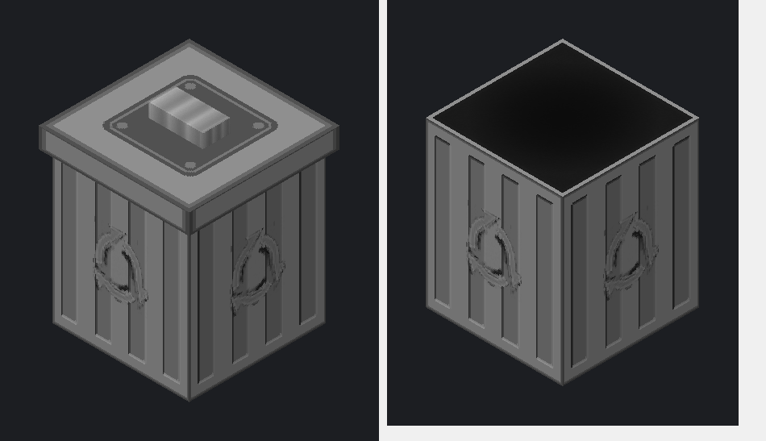
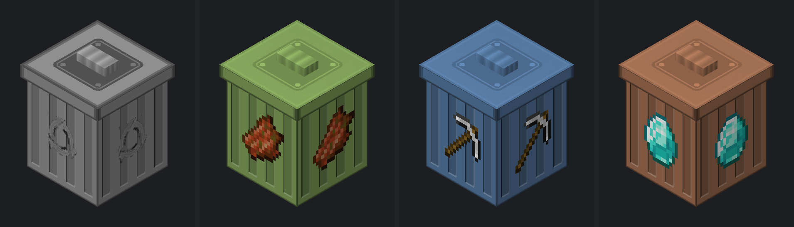

# Dustbin-Mod


> 掉落物不再无声消失 —— 它们会按类别滑进垃圾桶。  
> Dropped items no longer vanish silently — they sort themselves into a bin.

一个 **Minecraft 26.2** 的模组：原版里掉落物 5 分钟后直接消失；这个模组把它改成：**掉落物在设定时间后自动分类进桶**，你随时可以把东西捡回来。桶一共四种 —— **厨余 / 装备 / 矿物 / 其他**，各收各的。

A mod for **Minecraft 26.2**: in vanilla, dropped items despawn after 5 minutes. This mod changes that — items are **sorted into a bin** after a configurable delay, and you can take them back out whenever you like. There are four bins — **kitchen waste**, **equipment**, **minerals**, and everything else.



*左：关盖 · 右：开盖（95°）。此图由方块模型离线渲染，不含游戏内光影。*  
*Left: closed · Right: open at 95°. Rendered offline from the block model — no in-game lighting.*

---

## 支持的模组端 / Supported loaders

| 模组端 Loader       | 状态 Status                | 产物 Artifact                    |
| ---------------- | ------------------------ | ------------------------------ |
| Fabric           | 可用 / Available           | `dustbin-fabric-<version>.jar` |
| Forge / NeoForge | 尚未支持 / Not yet supported | —                              |

模组身份标识（mod id）是 `dustbin`，**不随模组端变化**；只有产物文件名带模组端后缀。这样把世界从 Fabric 构建切换到其他模组端时，存档里的垃圾桶与桶内物品可以原样保留。

The mod id is `dustbin` and **stays the same across loaders**; only the artifact filename carries a loader suffix. That way, moving a world from the Fabric build to another loader keeps every trash bin and its contents intact.

---

## 功能 / Features

### 掉落物进桶 / Items drop into the bin

- 物品存活时间达到阈值后，自动收入**对应的那个桶**，原版的 5 分钟消失逻辑被取消。  
  Items are collected into **the bin they belong to** as soon as they reach the configured age; vanilla's 5-minute despawn is cancelled.
- 阈值默认 **1 分钟**，可调范围 **1 ~ 1440 分钟**。  
  The default threshold is **1 minute**, adjustable between **1 and 1440 minutes**.
- 对应的垃圾桶已满时（54 格全占、且没有同类物品所在格），物品**回落到原版行为**正常消失 —— 它是兜底，不是无限仓库。  
  When the bin it belongs to is full (all 54 slots taken, with no slot holding the same item), items **fall back to vanilla despawn** — the bin is a safety net, not unlimited storage.


### 四类垃圾桶 / Four kinds of bin

| 垃圾桶 Bin                   | 收什么 What it collects                                                 | 合成时的中心材料 Core item |
| ------------------------- | -------------------------------------------------------------------- | ------------------ |
| **其他垃圾桶 / Other Bin**     | 兜底 —— 其它三类都不匹配的物品。Anything left over.                                | 箱子 / Chest         |
| **厨余垃圾桶 / Kitchen Bin**   | 食物与厨余。Food and kitchen scraps.                                       | 骨头 / Bone          |
| **装备垃圾桶 / Equipment Bin** | 工具、武器、护甲。Tools, weapons and armour.                                  | 铁镐 / Iron Pickaxe  |
| **矿物垃圾桶 / Mineral Bin**   | 矿石、原矿、锭、宝石、矿物块。Ores, raw materials, ingots, gems and mineral blocks. | 铁块 / Iron Block    |



> 从左到右：其他（灰 · 回收标志）/ 厨余（绿 · 腐肉）/ 装备（钢蓝 · 铁镐）/ 矿物（铜橙 · 钻石）。  
> Left to right: Other (grey · recycle mark), Kitchen (green · rotten flesh), Equipment (steel blue · iron pickaxe), Mineral (copper orange · diamond).

判定顺序是 **装备 → 厨余 → 矿物 → 其他**，第一个匹配的生效（所以一把铁镐进装备桶、铁锭进矿物桶，都不会落到其他桶）。

The order is **equipment → kitchen → minerals → everything else**, and the first match wins (so an iron pickaxe goes to the Equipment Bin and an iron ingot to the Mineral Bin — neither lands in the Other Bin).

**厨余**由四部分构成：一份固定的物品标签（骨头、骨粉、各类种子、腐肉、蜘蛛眼、毒马铃薯、甜菜根、蛋糕）；**任何带食物组件的物品**（模组食物因此能自动识别，无需逐个适配）；原生的「马能吃的东西」标签 `#minecraft:horse_food`（小麦、糖、干草块等）；以及可选的跨模组条目 —— `#c:foods/edible_when_placed`（「放下才能吃」的食物方块，如寿司拼盘与各类整块派）与农夫乐事的动物饲料（**马食**、狗粮）。

**Kitchen waste** comes from four sources: a fixed item tag (bone, bone meal, seeds, rotten flesh, spider eye, poisonous potato, beetroot, cake); **any item carrying the food component** — so modded food is picked up automatically with no per-mod work; the vanilla `#minecraft:horse_food` tag (wheat, sugar, hay blocks, …); and optional cross-mod entries — `#c:foods/edible_when_placed`, which covers food blocks you have to place down before eating (Farmer's Delight's sushi platter and whole pies), plus Farmer's Delight's animal feed (**horse feed** and dog food).

**装备**取自 `#minecraft:` 的镐、锹、斧、锄、剑、矛，以及四种护甲标签（头盔、胸甲、护腿、靴子）；**盾牌**与**三叉戟**单独登记（它们不属于上述任何标签，只能点名）；可选的 `#c:tools/knife` 让各类厨刀一并归入装备桶。剪子、打火石、刷子、钓鱼竿**不算**装备，仍进其他垃圾桶。

**Equipment** comes from the `#minecraft:` tags for pickaxes, shovels, axes, hoes, swords, spears and the four armour slots (helmet, chestplate, leggings, boots). **Shields** and **tridents** are listed by name, because no tag above covers them. The optional `#c:tools/knife` tag pulls in knives from various mods. Shears, flint and steel, brushes and fishing rods are **not** treated as equipment — they go to the Other Bin.

**矿物**收的是「从地里挖到的，或直接由这些材料铸成的」：八种矿石（煤、铜、铁、金、钻石、绿宝石、青金石、红石）、下界石英矿石、原矿与粗矿块、煤炭与木炭、金属粒、铜块（含氧化与涂蜡变种）、各类锭（铁 / 金 / 铜 / 下界合金）、下界合金碎片、钻石、绿宝石、青金石、红石、下界石英、紫水晶碎片、远古残骸，以及矿物块。**不收加工品** —— 铜门、铜台阶、红石灯、石英楼梯这类建材仍进其他垃圾桶。

**Minerals** covers what you dig out of the ground, or what is cast directly from it: the eight ore types (coal, copper, iron, gold, diamond, emerald, lapis, redstone), nether quartz ore, raw ores and raw ore blocks, coal and charcoal, metal nuggets, copper blocks (including the oxidised and waxed variants), every ingot (iron / gold / copper / netherite), netherite scrap, diamond, emerald, lapis lazuli, redstone, nether quartz, amethyst shards and ancient debris, plus the mineral blocks. **Crafted goods are excluded** — copper doors, copper stairs, redstone lamps and quartz stairs stay in the Other Bin.

上述跨模组引用全部标了 `required: false`（可选），所以**装或不装那些模组都不会导致标签加载失败**。

Every cross-mod reference is marked `required: false`, so they cannot break tag loading whether or not those mods are present.

分类规则全部写在数据包标签里，可以直接改标签、或用数据包覆盖，**不需要重新编译模组**。

All classification lives in datapack tags, so you can retune it by editing a tag or overriding it from a datapack — **no recompiling needed**.

### 54 格共享存储 / 54 slots, shared storage

| 规则 Rule                                           | 说明 Description                                                                                    |
| ------------------------------------------------- | ------------------------------------------------------------------------------------------------- |
| 同一维度内共享 / Shared per dimension                    | 同一维度内所有垃圾桶共用同一份存储，不是每个方块各存一份。Every bin in a dimension reads the same storage — not one per block. |
| 一种物品只占一格 / One item type per slot                 | 相同 id + 组件视为同种，绝不跨格堆放。Matching id + components count as one type, and never span slots.           |
| 每格上限 = 物品自身上限 / Per-slot cap = the item's own cap | 鸡蛋 16、石头 64、工具 1。Eggs 16, stone 64, tools 1.                                                      |
| 超出部分直接丢弃 / Overflow is discarded                  | 已存 64 个石头时再来 65 个 → 只保留 64，多出的丢掉。65 stone on top of 64 stored → keep 64, discard the rest.        |

### 只取不放 / Take-only GUI

GUI 是 6×9 的标准箱子布局，但**所有格子都禁止放入**物品（拖入、Shift 点击均无效）。想往桶里塞东西只有一条路：把物品丢在地上等它自己进去。

The GUI is a standard 6×9 chest layout, but **item placement is blocked in every slot** (drag and shift-click alike). The only way to put something in is to drop it on the ground and let it walk in by itself.

### 开盖动画 / Animated lid

打开界面时桶盖掀起，关闭时合上（ESC、走远、死亡、切换维度都会触发）。盖子由 BlockEntityRenderer 逐帧插值渲染，不是瞬间切换。

The lid lifts when the GUI opens and folds back when it closes (ESC, walking away, dying, or changing dimension). The lid is interpolated frame-by-frame by a BlockEntityRenderer — not an instant state swap.

### 朝向 / Facing

放置时垃圾桶的正面朝向玩家，规则与箱子一致；盖子的铰链在背面下沿，所以掀盖时盖子朝远离玩家的一侧翻起。简单说：**你从哪边放，它就从哪边打开**。

The bin's front faces you when placed, exactly like a chest. The lid hinges along its back edge, so it tips away from you — **whichever side you place it from is the side it opens towards**.

### 挖掘 / Mining

**石镐及以上**才能挖下（木镐挖了不掉落）。硬度与箱子同档：石镐约 0.8 秒、铁镐约 0.5 秒、钻石镐约 0.4 秒、下界合金镐约 0.3 秒。

Needs a **stone pickaxe or better** — a wooden pickaxe yields nothing. Hardness matches a chest's: roughly 0.8 s with stone, 0.5 s with iron, 0.4 s with diamond, 0.3 s with netherite.

### 指令 / Commands

| 指令 Command                                            | 作用 Description                                                                                                                        |
| ----------------------------------------------------- | ------------------------------------------------------------------------------------------------------------------------------------- |
| `/dustbin clear`                                      | 清空**全部四个桶**，并**逐个桶**报告各自清掉了几组。Empty every bin, reporting each bin's own count.                                                        |
| `/dustbin clear all`                                  | 同上，显式写法。The same thing, spelled out.                                                                                                  |
| `/dustbin clear <other\|kitchen\|equipment\|mineral>` | 只清空指定的**那一个**桶。Empty just that one bin.<br>`normal`（= other）、`tool`（= equipment）是等效别名，两种写法都认。`normal` and `tool` are accepted aliases. |
| `/dustbin settime <minutes>`                          | 设置收集阈值，范围 1 ~ 1440 分钟；所有桶**共用一个值**。Set the collection threshold (1–1440 minutes), shared by all bins.                                 |

权限：单人世界的房主可直接使用；多人服务器需要管理员权限。

Permissions: singleplayer hosts can use them directly; multiplayer servers require admin permission.

### 创造模式物品栏 / Creative tab

创造模式背包里有一个专属页签「**更多的垃圾桶 / More Bins**」，所有桶都放在里面。

Creative mode has a dedicated tab, **More Bins**, holding every bin.

### 成就 / Advancement

**首次合成任意一个垃圾桶**（不限哪一种）会解锁成就「**回收再利用！ / Recycle!**」。

Crafting **any** bin for the first time unlocks the advancement **Recycle!**

---

## 合成 / Crafting

四个桶的摆法完全一样 —— 8 个铁锭围住 1 个中心材料，**只有中心材料不同**。

All four bins share the same shape — 8 iron ingots around one core item — and **only the core differs**:

```
I I I
I C I
I I I
```

| 产物 Output             | 中心材料 Core (`C`)   |
| --------------------- | ----------------- |
| 其他垃圾桶 / Other Bin     | 箱子 / Chest        |
| 厨余垃圾桶 / Kitchen Bin   | 骨头 / Bone         |
| 装备垃圾桶 / Equipment Bin | 铁镐 / Iron Pickaxe |
| 矿物垃圾桶 / Mineral Bin   | 铁块 / Iron Block   |

`I` = 铁锭 / Iron Ingot

---

## 安装 / Installation

当前仅有 Fabric 构建，步骤如下：

Only a Fabric build is available for now:

1. 安装 **Fabric Loader ≥ 0.19.3** 与 **Fabric API**  
   Install **Fabric Loader ≥ 0.19.3** and **Fabric API**
2. 把 `dustbin-fabric-1.1.0.jar` 放进 `mods/`  
   Put `dustbin-fabric-1.1.0.jar` into `mods/`
3. 需要 **Java 25**  
   Requires **Java 25**

---

## 兼容性 / Compatibility

**Minecraft** 26.2 ・ **Java** ≥ 25 ・ **Fabric Loader** ≥ 0.19.3

Fabric 构建通过 Mixin 注入 `ItemEntity#tick`。与其他同样改写掉落物消失逻辑的模组同时使用时**可能冲突**，建议实测。

The Fabric build mixes into `ItemEntity#tick`. It **may conflict** with other mods that rewrite item despawn behaviour — test it before shipping it in a pack.

---


## 行为细节与已知限制 / Behaviour and known limitations

- **物品年龄只在所在区块被加载时增长。** 长期未加载的区块里的掉落物不会"到点进桶"，直到有人靠近。  
  **Item age only advances while the chunk is loaded.** Items in unloaded chunks will not be collected until a player comes back.
- **开盖角度 95°，盖子几乎竖直立在桶后，垂直占用超出方块本身。** 按模型几何实测：盖顶伸到方块顶面**上方约 0.37 格**，所以正上方紧贴方块时必然穿模；盖沿向后探出约 **0.035 格**，把角度压到 85° 以内即可消除。但即便压到 60°，盖顶仍有约 0.33 格高 —— 开盖的垂直占用无法靠调角度规避，只能靠留空解决。  
  **The lid opens to 95°**, standing almost vertically behind the bin, so it occupies space above the block. Measured from the model geometry: the lid top reaches about **0.37 blocks above** the block's top face, so a block directly overhead is always clipped; the tab juts roughly **0.035 blocks** rearward, which disappears once the angle drops below 85°. Even at 60°, though, the lid still stands about 0.33 blocks tall — the vertical footprint of an open lid cannot be designed away by lowering the angle, only accommodated by leaving headroom.
- **存储按维度保存在世界数据里。** 移除本模组后，数据文件仍留在存档中但不再被读取。  
  **Storage is saved per dimension** in the world data. If you remove the mod, the data file stays in the save but is never read again.

---

## 参与开发 / Contributing

欢迎提交 Issue 与 Pull Request。

Issues and pull requests are welcome.

构建 / Build:

```bash
./gradlew build
```

产物位于 `build/libs/dustbin-fabric-1.1.0.jar`。

The artifact lands in `build/libs/dustbin-fabric-1.1.0.jar`.

---

## 许可证 / License

[CC BY-NC-SA 4.0](LICENSE) —— 允许使用、修改与再分发，但**必须署名**、**不得用于商业用途**，且衍生作品需以相同协议共享。

[CC BY-NC-SA 4.0](LICENSE) — use, adaptation and redistribution are permitted, provided you **give attribution**, **do not use it commercially**, and **share derivatives under the same license**.
