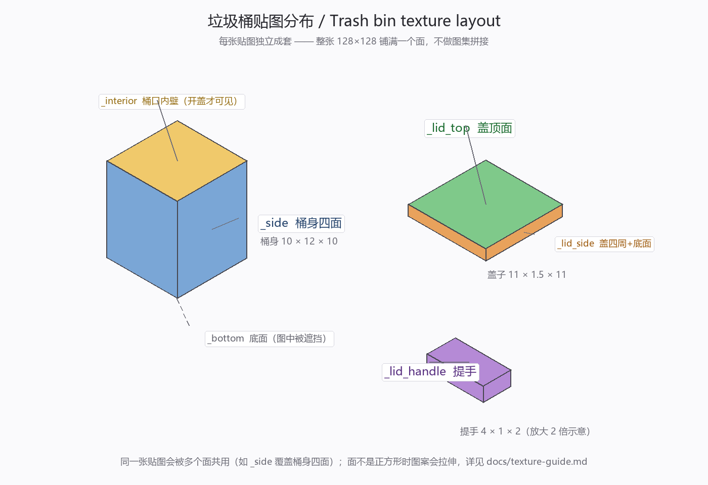

# 垃圾桶贴图制作要求 / Trash Bin Texture Guide

> 垃圾桶贴图规格与历史说明。
>
> **当前状态（2026-09-13）**：三类桶的正式贴图**已落地**——厨余桶采用玩家手绘的绿色系，
> 装备 / 矿物桶由同一套图保亮度换色相派生（钢蓝 / 铜橙）。本文保留作为**规格说明**：
> 以后想重画任何一套，按这里的规格交付即可无缝替换，无需改任何代码。
>
> 参考图：[`texture-layout.png`](texture-layout.png) —— 哪张贴图贴在哪个面上。

---

## 一、要交什么

**每类桶 6 张**，共 **4 类 × 6 = 24 张**。

| 类别 | 文件名前缀 | 状态 |
| --- | --- | --- |
| 其他垃圾桶 / Other Bin | `dustbin` | ✅ 正式美术（1.0.0 原版） |
| 厨余垃圾桶 / Kitchen Bin | `kitchen_dustbin` | ✅ 正式美术（玩家手绘绿色系，已落地） |
| 装备垃圾桶 / Equipment Bin | `tool_dustbin` | ✅ 正式美术（手绘同构图，色相转钢蓝） |
| 矿物垃圾桶 / Mineral Bin | `mineral_dustbin` | ✅ 正式美术（手绘同构图，色相转铜橙） |

即：**18 张已全部到位**。以后想替换任何一套，仍按本文件规格交付。

每套的 6 张分别是：

```
<前缀>_side.png          桶身四面
<前缀>_bottom.png        桶身底面
<前缀>_interior.png      桶身顶面（桶口 / 内壁）
<前缀>_lid_top.png       盖子顶面
<前缀>_lid_side.png      盖子四周 + 底面
<前缀>_lid_handle.png    顶部提手
```

---

## 二、硬性要求（不满足就跑不起来）

| 项目 | 要求 |
| --- | --- |
| **格式** | PNG |
| **色彩模式** | RGBA（带 Alpha 通道） |
| **尺寸** | **128 × 128**（正方形，四类桶全部一致） |
| **Alpha** | 只用 **0（全透）或 255（全不透）**，<br>⚠️ **不要用半透明**（如 128）—— 渲染用的是二值裁剪，半透明会变成"全不透"或突然破洞 |
| **存放目录** | `src/main/resources/assets/dustbin/textures/block/` |
| **文件名** | 严格照上表，**全小写 + 下划线**，一个字都不能差 |

> ⚠️ **目录是铁律，别挪**。必须放 `textures/block/`，因为同一个文件被两套机制消费：
> 方块模型（物品栏图标）要把图拼进 `minecraft:blocks` 图集，而该图集唯一的目录来源就是
> `textures/block/`。放到 `textures/entity/` 之类的地方，**世界里的桶正常、物品栏图标却变成紫黑格子**。

---

## 三、每张贴图贴在哪里



| 贴图 | 贴在哪 | 面的实际大小<br>（宽 × 高，单位：方块格） | 观感 |
| --- | --- | --- | --- |
| `_side` | 桶身**四个侧面**（北/南/西/东） | 10 × 12 | 主视觉，最重要的一张 |
| `_bottom` | 桶身**底面** | 10 × 10 | 通常看不到，但撬掉方块时会露 |
| `_interior` | 桶身**顶面**（桶口内壁） | 10 × 10 | **只有开盖时可见** |
| `_lid_top` | 盖子的**顶面** | 11 × 11 | 俯视时看到的那块 |
| `_lid_side` | 盖子的**四周侧面 + 底面** | 11 × **1.5**（侧面）<br>11 × 11（底面） | 侧面极扁，见下方警告 |
| `_lid_handle` | 顶部**提手**的 5 个面 | 4 × 2（顶）<br>4 × 1（前后）<br>2 × 1（左右） | 面积极小，简单为佳 |

### ⚠️ 比例变形（画之前务必看）

贴图是**整张 128×128 铺满整个面**（不切图集），所以面不是正方形的地方，图案会拉伸：

| 贴图 | 变形 | 怎么办 |
| --- | --- | --- |
| `_side` | **垂直方向拉伸约 20%**（面是 10 宽 × 12 高，却铺正方形的图）<br>→ 画正圆，游戏里会变成竖长椭圆 | 想让效果是正圆，就画成 **宽 : 高 ≈ 1.2 : 1** 的横椭圆；或干脆用竖条纹 / 无方向感的图案 |
| `_bottom`、`_interior`、`_lid_top`、`_lid_side` 的底面 | **无变形**（面本身就是正方形） | 正常画 |
| `_lid_side` 的**四周侧面** | **垂直方向被压缩约 8.5 倍**（128 px 挤进 1.5 格高）<br>→ 图案基本糊成一条线 | 只画**纯色**或**横向细条纹**，别画细节 |
| `_lid_handle` | 垂直方向拉伸 2 ~~4 倍，且整体只有几个像素大 | 纯色 / 极简纹理 |

---

## 四、四个最容易踩的坑

### 1. 桶身四面**共用同一张** `_side`

模型里北/南/西/东四个面全部引用 `#side`，且都是完整 UV。**所以四面图案必然一模一样**，
没法只让"正面"有 logo —— 画了 logo 就是四面都有。

> 如果你确实想要「正面专属图案」，告诉我，我改一版模型把正面拆出来单独引用一张贴图
> （例如 `_side_front`）。另外前后面与左右面的宽高比虽然都是 10×12，但**UV 方向不同**，
> 带文字的图案会在某一对面上左右颠倒 —— 文字类内容建议别画。

### 2. 不要做「图集拼接」

每张贴图都是**独立**的，不是把 6 个面拼进一张大图。别按原版方块图集的思路画。

### 3. 不要半透明

渲染路径用**二值裁剪**（alpha < 0.1 的像素直接丢弃，其余完全不透明）。
半透明渐变会退化成硬边，效果比预想差很多。

### 4. 洞不是"洞"

想做出镂空（真能透过去的洞）需要模型改渲染类型，当前不支持。
画成深色就够了，视觉上一样成立。

---

## 五、配色基调（当前正式贴图）

四类桶是**同一套造型**，整体明暗节奏一致，只有主色不同。
重画时建议保持这个"同族"关系，四个桶摆一排才像一套。

| 桶 | 桶身平均色 | 说明 |
| --- | --- | --- |
| 其他垃圾桶 | `#3c4738` 灰绿 | 1.0.0 原版 |
| 厨余垃圾桶 | `#738e51` 苹果绿 | 玩家手绘原色 |
| 装备垃圾桶 | `#4e6c8e` 钢蓝 | 手绘同构图，色相 212° |
| 矿物垃圾桶 | `#8e634a` 铜橙 | 手绘同构图，色相 22° |

---

## 六、交付与替换流程

1. 把 18 张 PNG 放进 `src/main/resources/assets/dustbin/textures/block/`，文件名严格照第一节
2. 告诉我一声 → 我重新构建 → 更新游戏 `mods/` 目录
3. ⚠️ **重新构建后 `docs/release-1.1.0.md` 里的三个校验值（大小 / MD5 / SHA-256）会变**，
   我会一并同步更新 —— 这一步不做，发行说明就是错的

> 贴图**不影响**代码逻辑，改完不必重新验证分类功能；但物品栏图标和世界里都要**实际看一眼**，
> 确认没有紫黑格子。

---

## 七、交付前自查清单

- [ ] 18 张齐全（`kitchen_dustbin` / `tool_dustbin` / `mineral_dustbin` 各 6 张）
- [ ] 全部是 **128 × 128**
- [ ] 全部是 PNG / RGBA
- [ ] **没有半透明像素**（alpha 只有 0 和 255）
- [ ] 文件名与前缀**完全一致**，全小写、下划线正确
- [ ] 全部放在 `textures/block/` 下，没有误放 `textures/entity/`
- [ ] 看一眼**物品栏图标**（创造栏「更多的垃圾桶」）没有紫黑格子
- [ ] 看一眼**世界里的桶**，开盖 / 关盖都正常、没有紫黑格子

---

## 附录 A：参考文件与脚本

| 用途 | 路径 |
| --- | --- |
| 正式美术参考（1.0.0 画的） | `assets/dustbin/textures/block/dustbin_*.png` |
| 厨余桶手绘原图（4 张参考） | `贴图/`（仓库外，未提交） |
| 三桶贴图生成脚本（本套正式贴图就是它产的） | `.workbuddy/scripts/design_new_bin_textures.py` |
| 旧占位图脚本（已被取代，留作备用） | `.workbuddy/scripts/gen_mineral_bin.py` |
| 桶身模型（世界中的方块） | `assets/dustbin/models/block/<前缀>_body.json` |
| 完整模型（物品栏图标，含盖子） | `assets/dustbin/models/block/<前缀>.json` |
| 盖子渲染代码（世界里的开盖动画） | `src/client/java/.../render/DustbinBlockEntityRenderer.java` |

> 生成脚本是**可复用的**：换 `USER` 里的参考图、调 `hue_shift` 的色相参数，就能再造或重调任意一套。

## 附录 B：为什么是这 6 张（技术背景）

- **桶身**（10×12×10 的方块，`from [3,0,3] to [13,12,13]`）走**普通方块模型**，
  由 `_side` / `_bottom` / `_interior` 三张图构成。
- **盖子**（11×1.5×11）和**提手**（4×1×2）走**方块实体渲染器**，因为它们要逐帧做开盖动画，
  而方块模型顶点是静态的、动不了。渲染器每帧用 `_lid_top` / `_lid_side` / `_lid_handle` 三张图重建几何。
- 两套机制对同一个文件施加的规则不同，但**都要求文件位于 `textures/block/`** —— 这就是第二节那条铁律的由来。
- 渲染器按**桶的种类**（注册名后缀）拼贴图路径，所以四种桶才能各有各的盖子外观。
